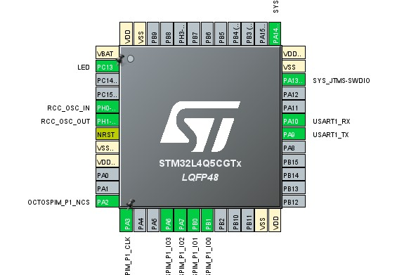

# STM32L4Q5CGT6 + ESP-PSRAM64H Memory-Mapped OctoSPI Example

This project demonstrates how to configure the STM32L4Q5CGT6 OctoSPI peripheral
to interface with the ESP-PSRAM64H (64Mbit / 8MB) PSRAM in memory-mapped mode.

The example shows how to:

- Initialize OctoSPI in Quad (4-4-4) mode
- Configure READ_CFG and WRITE_CFG commands
- Enable memory-mapped mode
- Access external PSRAM using normal pointer dereferencing
- Verify functionality by writing a different value every second

---

## Hardware

- MCU: STM32L4Q5CGT6
- PSRAM: ESP-PSRAM64H (64Mbit / 8MB)
- Interface: Quad SPI (4-4-4)
- Max PSRAM clock supported: 133 MHz

The ESP-PSRAM64H is compatible with APS6404L-3SQR,
and the memory-mapped configuration follows the same principles.

---
## Hardware Connections

### MCU: STM32L4Q5CGT6 (LQFP48)
### PSRAM: ESP-PSRAM64H (SOP8)

### STM32L4Q5CGT6 Pinout


### ESP-PSRAM64H Pinout

Quad SPI (4-4-4) connection:

| STM32 Pin | Signal | ESP-PSRAM64H Pin | Signal |
|------------|--------|------------------|--------|
| PA2        | NCS    | Pin 1            | CE#    |
| PA3        | CLK    | Pin 6            | SCLK   |
| PB1        | IO0    | Pin 5            | SI / SIO0 |
| PB0        | IO1    | Pin 2            | SO / SIO1 |
| PA7        | IO2    | Pin 3            | SIO2   |
| PA6        | IO3    | Pin 7            | SIO3   |
| VDD        | 3.3V   | Pin 8            | VCC    |
| VSS        | GND    | Pin 4            | VSS    |

---
## Clock Configuration

Current test configuration:

- OctoSPI clock prescaler: 64
- OctoSPI kernel clock: 32 MHz

The clock was intentionally set low to ensure signal integrity is not an issue
during initial testing.

You can increase the frequency in STM32CubeMX once memory-mapped mode is verified.

---

## How It Works

1. Reset PSRAM (0x66 / 0x99)
2. Enter Quad mode (0x35)
3. Configure:
   - READ_CFG → 0xEB (Fast Quad Read)
   - WRITE_CFG → 0x38 (Quad Write)
4. Enable memory-mapped mode
5. Access memory using:

```c
volatile uint8_t *psram = (uint8_t*)0x90000000;
psram[offset] = value;
uint8_t r = psram[offset];
